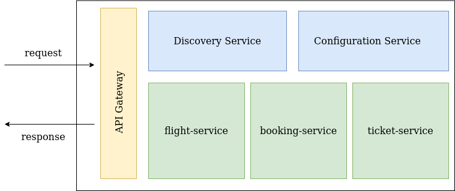

# Microservices Demo

A demo showing how to implement a simple microservices architecture using Spring Boot and Spring Cloud. 

## Components

 **API Gateway** Routes incoming requests to the appropriate microservices and returns responses to the caller. It 
 is implemented using Spring Cloud Gateway.

**Service Discovery** This is a Eureka service registry. The microservices register themselves on startup, 
which allows them find each other and allows the API gateway find them. This is especially useful when instances of 
the services are created and destroyed dynamically.

**Configuration Service** This allows configuration for the microservices to be externalized. For this implementation, 
the configs are kept in a local Git repo. Spring Cloud Config also provides support for solutions like HashiCorp's 
Vault.

**Microservices(_flight-service_, _booking-service_, _ticket-service_)** These are responsible 
for the business logic of the system. They handle client requests routed from the API gateway.
They can communicate with each other directly via REST over HTTP. 

## Stack

- Spring Boot
- Spring Data JPA 
- H2 Database
- Spring Cloud - Eureka, Gateway, Cloud Config.

### Manual Test Plan:

- Start Config Server.
- Start Eureka Server.
- Start Gateway.
- Start Each microservice.
- Send requests to routes configured on API Gateway.

TODO: Use Docker to containerize and orchestrate the services.
